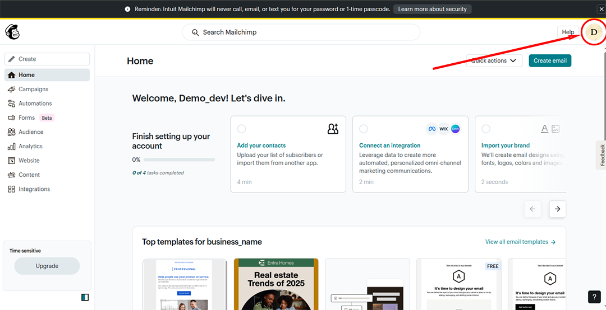
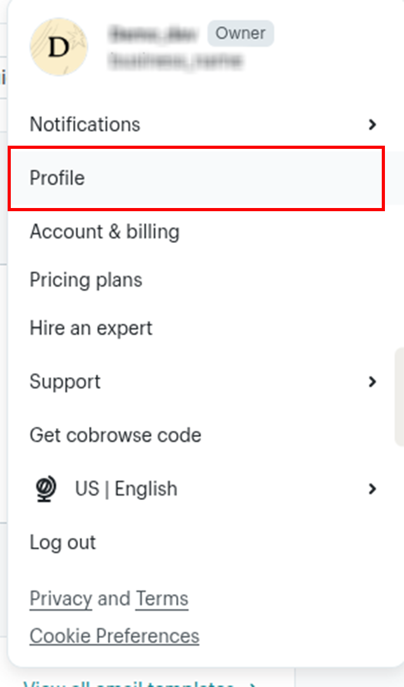
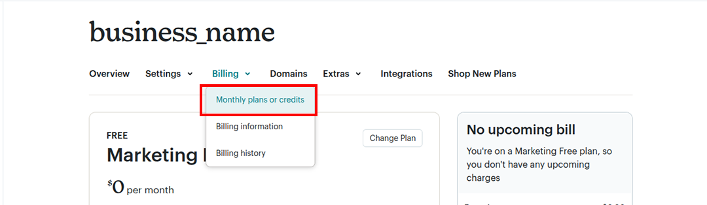
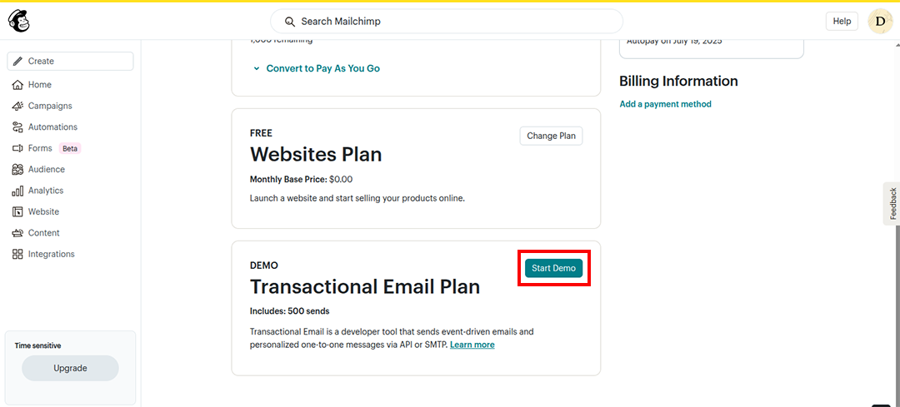
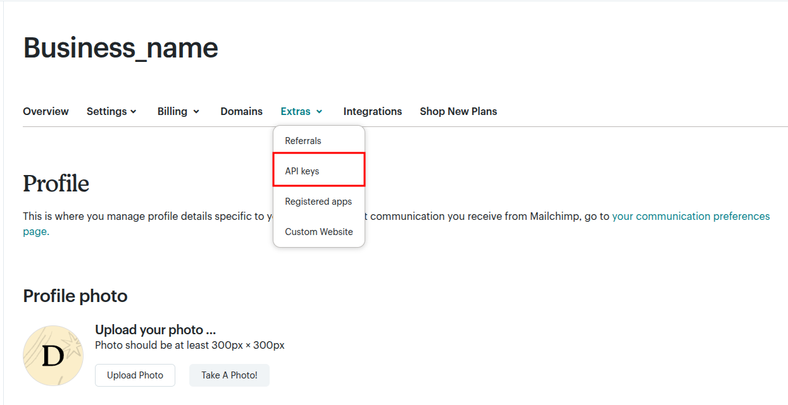
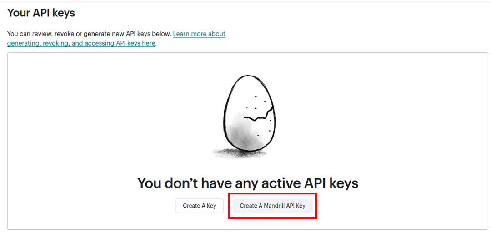
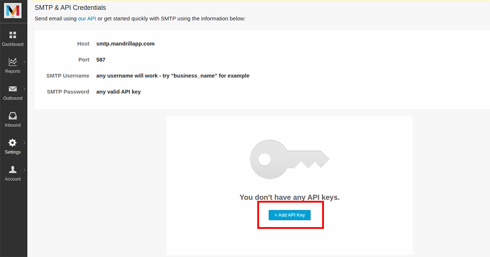
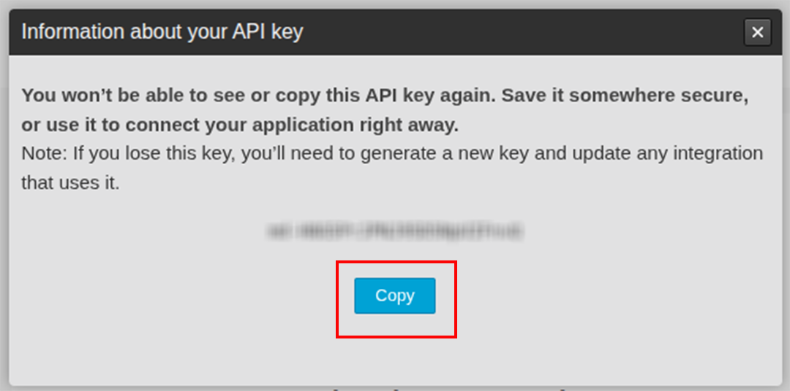

## Overview

[//]: # (TODO: Add overview mentioning the purpose of the module, supported REST API versions, and other high-level details.)

[Mailchimp Transactional Email](https://mailchimp.com/developer/transactional/) is a reliable and scalable email delivery service provided by Intuit Mailchimp, designed for sending data-driven transactional emails such as password resets, order confirmations, and notifications.

The `ballerinax/mailchimp.transactional` package provides APIs to connect and interact with the [Mailchimp Transactional API](https://mailchimp.com/developer/transactional/api/), enabling seamless integration with applications to manage transactional email sending, templates, messages, and more.

## Setup guide

[//]: # (TODO: Add detailed steps to obtain credentials and configure the module.)

To use the Mailchimp Transactional Email connector, you need to have a Mailchimp account and access to a Mandrill API key. Follow the steps below to set up your account and generate the required API key.

### Step 1: Create a Mailchimp Account

1. Go to the [Mailchimp Sign Up Page](https://login.mailchimp.com/signup/) and create a Mailchimp account.

2. Once signed in, click on your profile icon in the bottom-left corner to access the account menu.

    
    


### Step 2: Enable Transactional Email

1. In the menu, go to **Billing**.

    

2. Under **Monthly plans or credits**, select the **Transactional Email** plan (you can start with the demo plan).

    

### Step 3: Generate a Mandrill API Key

1. After enabling the transactional email feature, navigate to the **Extras** section and click on **API keys**.

    

2. Choose **Create Mandrill API Key** (not the regular API key). You will be redirected to the [MandrillApp Dashboard](https://mandrillapp.com/).

    

3. In the MandrillApp dashboard, click **Add API Key** to generate your key.

    

4. Copy the generated API key. You will need this to authenticate your connector.

    


## Quickstart

[//]: # (TODO: Add a quickstart guide to demonstrate a basic functionality of the module, including sample code snippets.)

To use the `Mailchimp Transactional` connector in your Ballerina application, update the `.bal` file as follows:

### Step 1: Import the module

Import the `mailchimp.transactional` module.

```ballerina
import ballerinax/mailchimp.'transactional;
```
### Step 2: Configure the API Key

1. Create a `Config.toml` file and add your Mandrill API key obtained from the setup process:

```bash
key = "<Access Token>"
```

2. Declare the key as a configurable variable and create a `mailchimp.transactional:Client` instance:

```ballerina
configurable string key = ?;

mailchimp:ConnectionConfig conConfig = check {};

final mailchimp:Client mailchimp = check new(conConfig,serviceUrl);
```

### Step 3: Send a transactional email

Here’s how you can send a simple transactional email using the connector:

```ballerina
public function main() returns error? {
    mailchimp:MessagesSendBody payload = {
        'key: key,
        message: {
            fromEmail: "noreply@yourdomain.com",
            to: [{ email: "customer@example.com"}],
            subject: "Your Order Confirmation",
            text: "Text",
            autoText: true
            
        }
    };
    mailchimp:InlineResponse20028[] sendResponse = check mailchimp->/messages/send.post(payload);
    if sendResponse.length() == 0 {
        io:println("No responses received.");
        return error("Empty response from Mailchimp API");
    }

    foreach var response in sendResponse {
        io:println("Email sent successfully: ", response.toBalString());
    }
}

```

### Step 4: Run the Ballerina application

```bash
bal run
```

## Examples

The `MailChimp Transactional Emails` connector provides practical examples illustrating usage in various scenarios. Explore these [examples](../examples/README.md), covering the following use cases:

[//]: # (TODO: Add examples)
